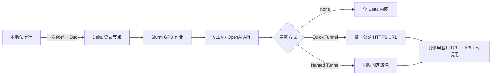

# Delta LLM Pipeline

面向 NCSA Delta 的一键式大模型推理部署工具。每位组员使用自己的 NCSA 账号完成一次密码和 Duo 验证，工具随后自动创建运行环境、提交 Slurm GPU 作业、启动 vLLM，并返回 OpenAI 兼容的 `base_url` 和随机 API key。

> 当前定位：研究原型。`cloudflare-quick` 适合短期实验，不是正式生产网关。将 Delta 计算节点暴露到公网前，请先取得项目 PI 和 NCSA 的许可。

## 它解决什么问题

一次 `deploy` 命令完成下面整条链路：



- 不保存 NCSA 密码或 Duo 信息；认证提示由系统 OpenSSH 直接显示。
- 每位成员仍使用自己的账号提交作业，计费和审计归属清晰。
- 共享 `/projects/bhsz/delta-llm/shared` 中的 vLLM 环境和 Hugging Face 缓存，避免每个人重复下载。
- 每次部署生成独立 API key；停止作业时删除远端 key。
- 最长运行 48 小时，默认 47.5 小时，避免触碰 Delta 上限。

## 重要限制

1. Slurm 作业不是永久服务器。作业可能排队、失败、被管理员终止，并会在 wall time 到期时停止；API key 本身不会延长算力生命周期。
2. `cloudflare-quick` 返回随机 URL，无 SLA，Cloudflare 官方明确说明它不支持 SSE，因此流式响应请设置 `stream=False`。Quick Tunnel 还有 200 个并发请求限制。
3. `cloudflare-named` 需要团队自己的 Cloudflare 域名、Tunnel 和 token。不要把 token 写入 Git。
4. Delta 普通账户通常不能使用 SSH 公钥；后续的 `status/logs/stop` 是新的 SSH 操作，因此通常会再次要求 Duo。需要真正的无人值守管理时，应向 NCSA 申请 Gateway/服务账号方案。
5. 公开 URL 等于把研究服务放到互联网上。API key 是唯一应用层凭据，请不要放进代码、聊天记录、Issue 或公共日志。

## 先决条件

本地电脑需要：

- Python 3.10 或更高版本
- OpenSSH 客户端，终端中执行 `ssh -V` 能成功
- 可用的 NCSA/ACCESS 账号、Duo，以及 `bhsz-delta-gpu` allocation
- Git（仅克隆代码需要）

Windows 10/11 可在“可选功能”中启用 **OpenSSH Client**。本工具直接支持 PowerShell，不要求 WSL。

## 安装

```bash
git clone <YOUR_GITHUB_REPOSITORY_URL>
cd delta-llm-pipeline
python -m venv .venv
```

PowerShell：

```powershell
.\.venv\Scripts\Activate.ps1
python -m pip install -e .
Copy-Item config.example.toml config.toml
```

macOS/Linux：

```bash
source .venv/bin/activate
python -m pip install -e .
cp config.example.toml config.toml
```

`config.example.toml` 已包含本组的 allocation 和存储根目录。组员一般不需要修改。也可以不安装包，直接使用 `run.ps1` 或 `run.sh`。

## 第一次使用

先检查账号、分区、存储和外网连接：

```powershell
.\run.ps1 --username your_ncsa_username doctor
```

查看内置模型和 GPU 组合：

```powershell
.\run.ps1 models
```

启动交互式部署：

```powershell
.\run.ps1 --username your_ncsa_username deploy
```

程序会依次让你选择模型、GPU 类型、卡数、运行时长和暴露方式，然后 OpenSSH 会提示 NCSA 密码和 Duo。认证完成后不需要再逐行输入命令。

首次部署时，如果共享 vLLM 环境不存在，工具会额外提交一个 1 小时上限的 A40 安装作业。它通常只发生一次，但也需要排队并产生少量 GPU 计费。模型首次下载也会增加启动时间。

默认固定使用经过 Delta CUDA 12.8 驱动验证的 vLLM 0.10.2 wheel。不要只修改 `vllm_version`：若要升级，还必须在 `config.toml` 同时填写确实存在且与 Delta 驱动兼容的 `vllm_wheel_url`。

### 推荐的非交互参数

新版 4B 小模型、单张 A40、运行 47.5 小时，并创建临时公网 URL：

```powershell
.\run.ps1 --username your_ncsa_username deploy `
  --model qwen3-4b-instruct --gpu a40 --gpus 1 --hours 47.5 `
  --exposure cloudflare-quick --acknowledge-external-tunnel
```

只在 Delta 内部监听，不经过第三方隧道：

```powershell
.\run.ps1 --username your_ncsa_username deploy `
  --model qwen2.5-14b --gpu a40 --gpus 1 --hours 24 --exposure none
```

macOS/Linux 把 `run.ps1` 换成 `./run.sh`，并使用 `\` 续行。

先验证选项但不登录、不提交作业：

```bash
./run.sh --username your_ncsa_username deploy \
  --model deepseek-r1-32b --gpu a40 --gpus 2 --hours 4 \
  --exposure none --dry-run
```

## 模型和 GPU 建议

显存判断包含权重、vLLM 运行时和 KV cache 的保守余量，但实际容量仍取决于上下文长度、并发量和 vLLM 版本。

| 选项 | 权重格式 | 默认上下文 | 建议起点 | 适用场景 |
|---|---:|---:|---:|---|
| `qwen3-4b-instruct` | BF16 | 32K | 1× A40 | 新版小参数、低成本接口实验 |
| `qwen3-8b` | BF16 | 32K | 1× A40 | 吞吐、功能测试、低成本实验 |
| `qwen2.5-14b` | BF16 | 8K | 1× A40 | 效果与成本平衡 |
| `qwen3-32b-awq` | AWQ 4-bit | 16K | 1× A40 | 单卡运行更大的模型 |
| `deepseek-r1-32b` | BF16 | 16K | 2× A40 或 1× H200 | 推理类实验 |

GPU 计费因子来自 Delta 文档：A40 为 0.5、A100x4 为 1.0、A100x8 为 1.5、H200 为 3.0。粗略消耗为：

```text
卡数 × wall time 小时 × GPU 计费因子
```

例如 1×A40 运行 47.5 小时约为 23.75 weighted GPU-hours；这是预算估算，不替代 `accounts`/Slurm 的实际记录。优先选 A40，除非模型显存、性能或排队情况要求更高规格。

## 调用 API

部署完成后会显示：

```text
Base URL: https://random-name.trycloudflare.com/v1
API Key:  sk-delta-...
```

Python OpenAI SDK：

```bash
python -m pip install openai
export DELTA_LLM_BASE_URL='https://.../v1'
export DELTA_LLM_API_KEY='sk-delta-...'
python examples/openai_chat.py
```

PowerShell 环境变量写法：

```powershell
$env:DELTA_LLM_BASE_URL = "https://.../v1"
$env:DELTA_LLM_API_KEY = "sk-delta-..."
python .\examples\openai_chat.py
```

curl：

```bash
curl "$DELTA_LLM_BASE_URL/chat/completions" \
  -H "Authorization: Bearer $DELTA_LLM_API_KEY" \
  -H "Content-Type: application/json" \
  -d '{"model":"qwen3-4b-instruct","messages":[{"role":"user","content":"Hello"}],"stream":false}'
```

模型名称使用本工具的短名称，例如 `qwen3-4b-instruct`。Quick Tunnel 下必须使用非流式请求。

## 管理部署

```bash
delta-llm --username your_ncsa_username list
delta-llm --username your_ncsa_username status DEPLOYMENT_ID
delta-llm --username your_ncsa_username logs DEPLOYMENT_ID --lines 200
delta-llm --username your_ncsa_username stop DEPLOYMENT_ID
```

`stop` 会取消 Slurm 作业，并删除远端 API key 和 endpoint 文件。部署结果（包括 API key）保存在运行命令那台电脑的 `~/.delta-llm/deployments/*.json`；该目录已被 Git 忽略。团队共享时建议通过密码管理器传递 URL 和 key，不要把状态文件提交到仓库。

## 三种暴露模式

### `none`（默认，最安全）

vLLM 监听计算节点端口，只能从 Delta 网络内访问。适合先验证服务，或后续接入 NCSA 批准的 Gateway。它不能直接满足“任意外部电脑访问”。

### `cloudflare-quick`（短期实验）

自动下载 `cloudflared`，创建随机 `trycloudflare.com` HTTPS 地址。无需 Cloudflare 账号，但地址可能变化；作业 requeue 后也可能变化。该模式必须显式确认外部隧道风险。

### `cloudflare-named`（团队固定域名）

先在 Cloudflare 中创建 Tunnel，将公共 hostname 指向 `http://127.0.0.1:8000`，然后：

```bash
export DELTA_LLM_CF_TUNNEL_TOKEN='...'
```

在 `config.toml` 填写：

```toml
[exposure]
default_mode = "cloudflare-named"
named_public_url = "https://llm.example.org"
```

再用 `--exposure cloudflare-named` 部署。token 仅通过当前 SSH 会话写入该部署的 `secrets` 目录，不会写入生成的 Slurm 脚本文本。

## 安全设计

- NCSA 密码和 Duo：仅由 OpenSSH 处理，本程序不读取、不保存。
- API key：本地随机生成，经加密 SSH 发送；远端文件权限为 `0600`。
- 公网模式：vLLM 仅监听 `127.0.0.1`，外部流量必须经过 Tunnel。
- 组共享：只共享 vLLM 环境、模型缓存和 `cloudflared` 二进制，不共享个人 API key。
- 日志：命令不会把 API key 作为 vLLM 参数写入 Slurm 日志，而是使用 `VLLM_API_KEY` 环境变量。

更完整的威胁模型和操作清单见 [docs/SECURITY.md](docs/SECURITY.md)。向 NCSA 申请合规公网 Gateway 时可参考 [docs/NCSA_TICKET_TEMPLATE.md](docs/NCSA_TICKET_TEMPLATE.md)。

## 常见问题

**出现 `getsockname failed: Not a socket`**
常见原因是 Windows OpenSSH 误用了 Unix 风格的连接复用配置。本工具显式禁用 `ControlMaster/ControlPath`。若直接运行 `ssh` 仍报错，检查 `~/.ssh/config` 并删除或按主机禁用相关设置。

**作业一直是 PENDING**
这是 Slurm 排队，不是脚本卡死。终端会持续显示原因，例如 `Resources` 或 `Priority`。可选择 A40、减少卡数，或稍后重试。

**模型启动时 CUDA OOM**
降低 `--max-model-len`、减少并发请求，或选择更多/更大显存的 GPU。目录中的模型建议是保守起点，不是绝对保证。

**返回 401**
确认请求头是 `Authorization: Bearer <API_KEY>`，并且 key 与该次部署匹配。

**Quick Tunnel 请求中断或流式输出失败**
设置 `stream=False`。若需要稳定域名、SSE 或长期服务，使用经批准的 Named Tunnel/NCSA Gateway。

**本地终端关闭后服务会不会停止？**
Slurm 作业会继续运行。若部署命令还在等待 READY，关闭终端会丢失自动打印结果；可稍后重新登录执行 `list/status/logs`。API key 只会在部署命令正常拿到结果后写入本地状态文件。

## 配置与开发

所有可提交配置都在 `config.example.toml`；个人 `config.toml` 被 `.gitignore` 排除。

```bash
python -m pip install -e '.[dev]'
python -m pytest
ruff check .
```

关键官方资料：

- [Delta Running Jobs（48 小时上限与 GPU 因子）](https://docs.ncsa.illinois.edu/systems/delta/en/latest/user_guide/running_jobs.html)
- [Delta Login（SSH 与 Gateway 说明）](https://docs.ncsa.illinois.edu/systems/delta/en/latest/user_guide/login.html)
- [Delta Job Accounting](https://docs.ncsa.illinois.edu/systems/delta/en/latest/user_guide/job_accounting.html)
- [vLLM GPU 安装](https://docs.vllm.ai/en/latest/getting_started/installation/gpu/)
- [vLLM OpenAI-compatible Server](https://docs.vllm.ai/en/latest/serving/online_serving/openai_compatible_server/)
- [Cloudflare Quick Tunnels 限制](https://developers.cloudflare.com/cloudflare-one/networks/connectors/cloudflare-tunnel/do-more-with-tunnels/trycloudflare/)

## License

MIT。模型本身遵循各自模型卡和许可证，本仓库的 MIT 许可证不覆盖模型权重。
